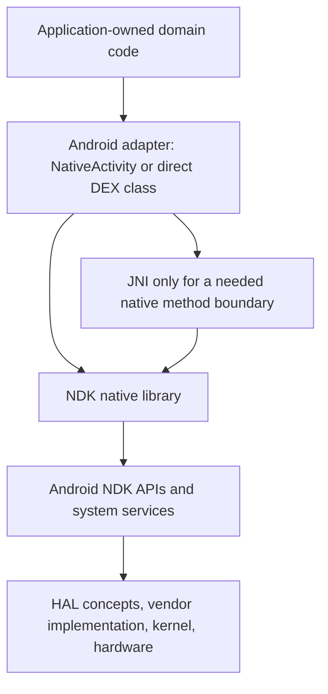

# Generic Android-native architecture

`android-NDK` owns the reusable Android-native route.  Applications own the
meaning of their data, their mathematics, their renderer, their interaction
semantics, and their target-specific optimization choices.

The diagram describes a route, not a universal implementation.  A native-only
app can use framework `NativeActivity` with no application `classes.dex` and
no JNI.  An app that needs its own Android-facing class can directly emit DEX,
then use a narrow JNI declaration to enter a native library.  A device-specific
program may replace one generic native backend without replacing the rest.

## Ownership

| Owner | Owns | Does not automatically own |
| --- | --- | --- |
| application repository | mathematics, simulation, rendering, domain state, UI meaning, target-specific algorithm choices | a reusable Android/NDK substrate |
| this repository | DEX/ART mechanics, JNI/native boundaries, NativeActivity patterns, APK route, reusable native acquisition interfaces | the application's semantic work or a false universal hardware layer |
| detailed hardware repository | board wiring, drivers, HAL reachability, device measurements, ABI/GPU facts, target optimization | a claim that its device behavior generalizes to every Android target |

## Normal APK route

An ordinary application keeps its manifest, resources, package identity,
application library name, and signing identity in its own repository.  The
generic route is:

1. compile one native shared library for each selected Android ABI;
2. optionally generate an application-owned `classes.dex` directly, or use
   `android.app.NativeActivity` with `android:hasCode="false"`;
3. link the manifest/resources with `aapt2`;
4. add `lib/<abi>/…so`, optional `classes.dex`, and application assets;
5. align with `zipalign`, sign with the declared signer, and verify the
   resulting APK and signer; and
6. distribute ABI-specific APKs or use an application-owned store/AAB lane
   when that consumer needs one.

[`apk/`](apk/) records the boundary and the recovered precedents.  This
repository does not silently pick an application signer, package name,
minimum SDK, resource set, or store channel.

## DEX, JNI, and NativeActivity have separate jobs

### Direct DEX / ART

[`dex/`](dex/README.md) contains the recovered direct Idriç DEX backend.
It lowers checked ANF into a typed DEX plan and then emits `classes.dex`
directly.  Its small checked `Int32` slice does not become ARM/Thumb,
renderer, JNI, or full Android application evidence merely because ART can
load it.

The DEX backend neither generates Java nor passes application semantics through
`javac`, Kotlin, Gradle, or `d8`.  Smali remains an external oracle/harness,
not a candidate-producing fallback.

### JNI

JNI bridges an Android/framework-facing class to a native method only when an
application needs that crossing.  It is not a frame-loop mechanism and it is
not a replacement for a native application architecture.  The present
Wegert/Reddit/NativeActivity fixtures under `dex/idric/` remain clearly marked
as historical application-boundary evidence, not a general Android object
lowerer.

### NDK / NativeActivity

NativeActivity supplies an Android-native lifecycle and window boundary without
requiring application DEX.  Pauli demonstrates that DEX-free shape; Wegert
demonstrates a direct-DEX/JNI shape.  Each stays a consumer, not the owner of
the reusable substrate.

## Binder and system-service boundary

[`binder/`](binder/) owns the reusable IPC mechanics between Android processes
and system services. It is separate from both application policy and HAL/device
access.

The current Binder work keeps two lanes explicit:

- public NDK Binder for native local binders, caller identity observation,
  transactions, parcels, liveness, and death notifications;
- direct DEX/framework calls where ART-level APIs or hidden framework behavior
  are part of the required semantics.

A successful Binder transaction proves neither HAL access nor a complete
application privilege model. Conversely, a Binder broker can be useful without
claiming direct hardware access.

## Generic interfaces and the HAL boundary

The NDK normally reaches public Android native APIs such as AAudio,
`ASensorManager`, `ANativeWindow`, EGL, and `ALooper`.  Those APIs may route
through framework services and vendor implementation layers toward a HAL,
kernel driver, or hardware device.

The public API boundary, Binder/service boundary, HAL boundary, kernel-facing
boundary, and chip/bus boundary are distinct facts.  A successful AAudio or
accelerometer call does not prove direct HAL or chip access.  A denied lower
layer does not invalidate a working public Android-native interface.

[`native/`](native/) holds the current reusable input interfaces.  The
[`hardware/`](hardware/) tree preserves device-specific reference dossiers and
their original sources without pretending that a MIRO A1, TAB_P10, GitHub
runner, or a particular GPU has the same implementation.

## Target-specific lanes remain separate

| Target or concern | Appropriate home | Relationship here |
| --- | --- | --- |
| MIRO A1 / SC9863A / PowerVR | device and hardware research | indexed reference and ABI constraints |
| TAB_P10 / A333 / Mali-G57 | device and hardware research | indexed reference and ABI constraints |
| ICK compiler Android qualification | `dilapidated-shed/ick` | source-specific release-gate reference |
| Wegert direct DEX/JNI renderer | `isomorphismes/wegert` | integration proof and historical fixture |
| Fourier-sound microphone acceptance | `isomorphismes/Fourier-sound` | reusable input backend copied; application remains there |
| accelerometer model and hardware namespace | `Ashtray-Archer/utilities-android-phone-user` | reusable NDK adapter copied; model and hardware work remain there |
| Pauli orbital viewer | `isomorphismes/pauli` | native-only consumer reference |
| SURFER prepared-surface renderer | `isomorphismes/algebraic-variety-explorer-mobile` | incomplete application-specific JNI consumer, retained in place |

The [migration inventory](provenance/migration-inventory.md) provides exact
branches, paths, commits, and status for the recovered work.
